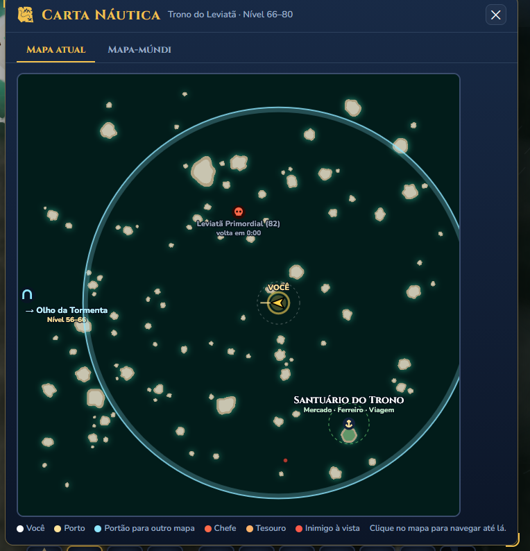
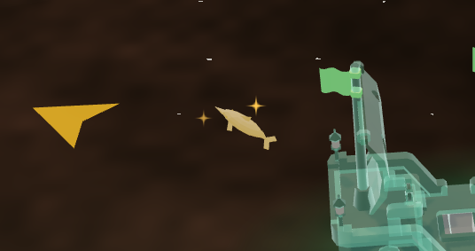
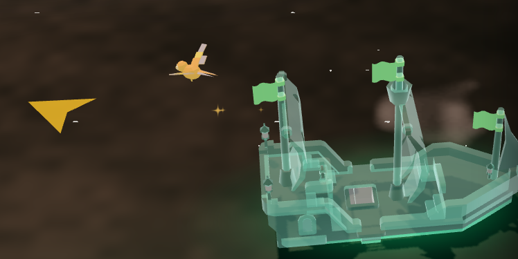
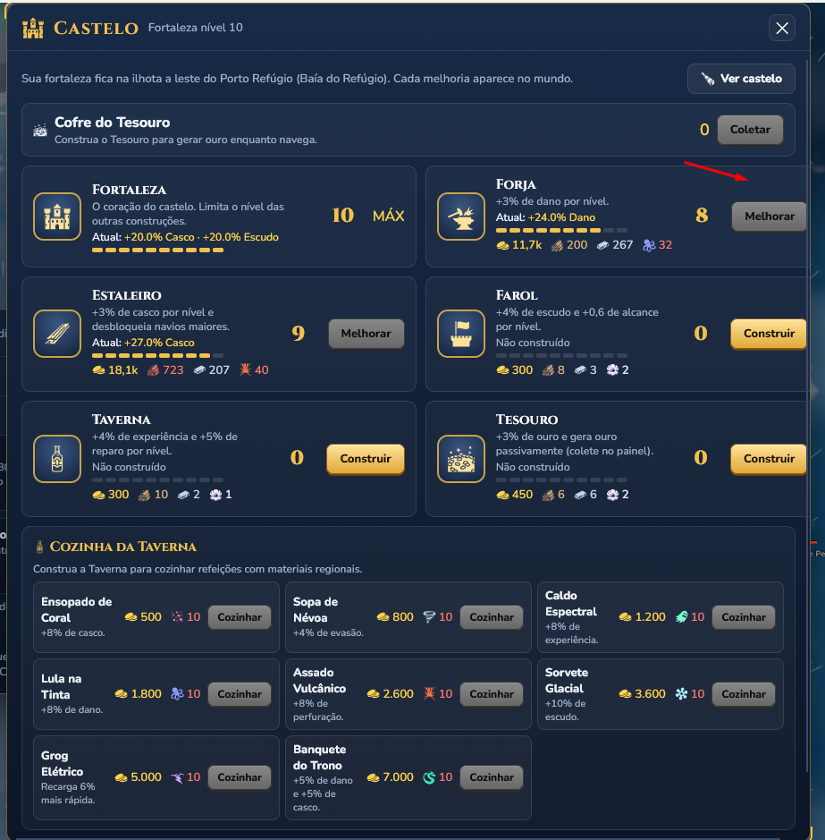
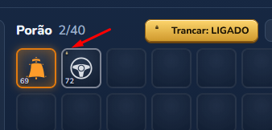
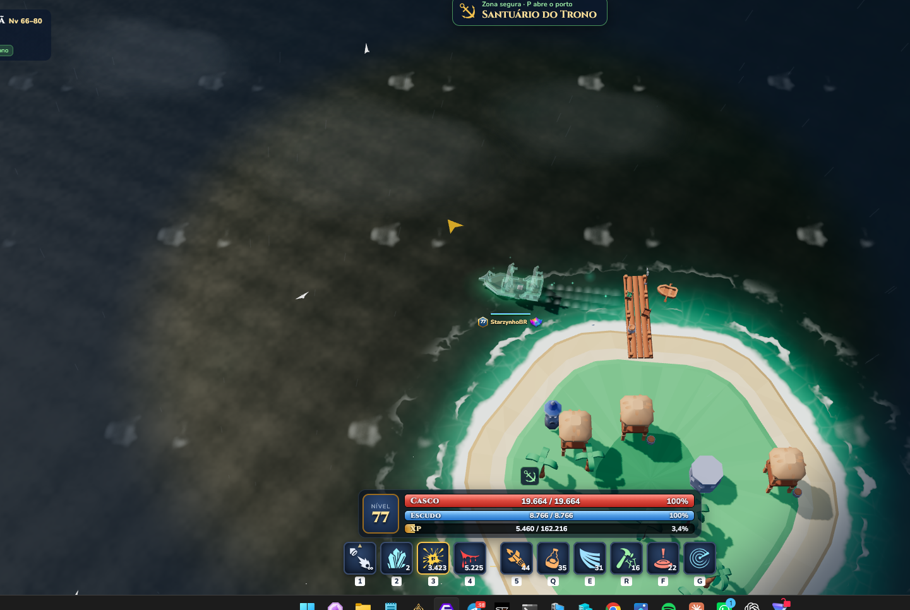
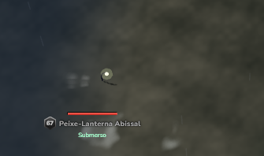
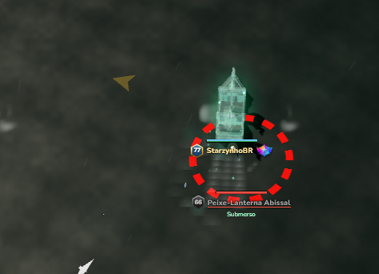

# Bugs encontrados — QA

Registro dos problemas encontrados durante os testes do jogo. Adicionar novos casos com IDs sequenciais e atualizar o status conforme forem investigados, corrigidos e retestados.

## BUG-007 — Expedição termina sem aviso e jogador permanece em mapa sem NPCs

- **Data do relato:** 30/09/2026.
- **Status:** aberto — relatado durante teste manual; reprodução independente pendente.
- **Sistema:** encerramento e saída de expedições.
- **Impacto:** jogador não consegue identificar se a expedição terminou ou se retornou ao mundo normal; continuidade do jogo prejudicada pela ausência de NPCs relatada.

### Comportamento observado

Após finalizar uma expedição, não apareceu indicação de conclusão ou saída. Segundo o jogador, o jogo permaneceu em um mapa sem NPCs.

A captura mostra a carta náutica identificada como Trono do Leviatã e o marcador do Leviatã Primordial com “volta em 0:00”. Ela não comprova, sozinha, a ausência de NPCs no mundo nem se o jogador ainda estava na instância da expedição.

### Comportamento esperado

Informar claramente a conclusão da expedição e o resultado, além de disponibilizar ou executar a saída conforme a regra do jogo. Ao retornar ao mapa normal, restaurar seu funcionamento e a presença de NPCs conforme as regras de surgimento.

### Caminho para tentar reproduzir

1. Iniciar uma expedição e cumprir seus objetivos até a conclusão.
2. Observar se aparece uma mensagem ou tela de resultado e indicação de saída.
3. Verificar o estado da expedição, o mapa atual e a presença de NPCs após o encerramento.

### Dados a coletar e reteste

Registrar nome da expedição, último objetivo, forma de saída e tempo de espera após a conclusão. Investigar separadamente a notificação de resultado, a transição de instância e o carregamento/surgimento dos NPCs, sem presumir a causa. Confirmar também a entrega das recompensas uma única vez e a possibilidade de continuar jogando ou iniciar outra expedição.

## BUG-006 — Brilho de nível máximo altera as cores do mascote

- **Data do relato:** 30/09/2026.
- **Status:** aberto — problema visual relatado, com duas capturas.
- **Sistema:** aparência dos mascotes; efeito de brilho no nível máximo.
- **Impacto:** perda das cores e da identidade visual do mascote.

### Comportamento observado

Segundo o relato, ao atingir o nível máximo o mascote recebe um brilho que muda completamente sua coloração para um amarelo uniforme. As capturas mostram dois mascotes com tonalidade amarela e partículas de brilho; não há comparação com a aparência anterior nas imagens.

### Comportamento esperado e direção sugerida

O brilho deve destacar a evolução sem substituir as cores originais. Ajustar o efeito para preservar a aparência do mascote, usando, por exemplo, partículas, contorno luminoso ou brilho de intensidade moderada. A causa técnica ainda não foi investigada.

### Critério para reteste

Comparar a aparência antes e depois do nível máximo em diferentes mascotes e condições de iluminação. Confirmar que o brilho é perceptível sem apagar suas cores e detalhes.

## BUG-005 — Alinhamento da interface do Castelo

- **Data do relato:** 29/09/2026.
- **Status:** aberto — problema visual ilustrado na captura.
- **Sistema:** janela Castelo; cards de construções.
- **Impacto:** apresentação inconsistente e controles próximos demais da borda direita.

### Comportamento observado

Na captura, os botões da coluna direita (Forja, Farol e Tesouro) ficam próximos da borda da janela, com espaçamento diferente dos controles da coluna esquerda. A seta destaca a região da Forja.

### Comportamento esperado e direção sugerida

Corrigir o alinhamento dos cards e de seus controles, mantendo margens internas consistentes, botões inteiramente dentro dos cards e espaçamento adequado em relação à borda e à barra de rolagem.

### Critério para reteste

Validar a janela nas resoluções e escalas de interface suportadas, incluindo rolagem e estados Construir, Melhorar e MÁX, sem cortes, sobreposição ou perda de margem nos controles.

## BUG-004 — Cadeado de item trancado pouco visível

- **Data do relato:** 29/09/2026.
- **Status:** aberto — problema visual relatado e ilustrado na captura.
- **Sistema:** inventário; indicador de item trancado, introduzido na v1.4.0.
- **Impacto:** dificulta identificar rapidamente quais itens estão protegidos contra venda.

### Comportamento observado

O cadeado no canto do slot é muito pequeno e difícil de perceber. A captura destaca o indicador com uma seta.

### Comportamento esperado e direção sugerida

O estado trancado deve ser legível na visualização normal do inventário. Aumentar o ícone e melhorar seu contraste com o fundo, preservando a leitura do item e de seu nível. Avaliar um fundo ou contorno para manter a identificação clara em diferentes raridades.

### Critério para reteste

Confirmar que é fácil distinguir itens trancados e destrancados nas escalas de interface suportadas, sem precisar ampliar a tela e sem sobrepor outras informações do slot.

## BUG-001 — Peixe-Lanterna Abissal permanece submerso

**Correção anunciada:** Corrigida a emergência para capitães de nível muito superior ao monstro.

- **Data do relato:** 29/09/2026.
- **Status:** corrigido na v1.4.0, conforme atualização informada; reteste pendente.
- **Mapa:** Trono do Leviatã.
- **Monstro:** Peixe-Lanterna Abissal (nível 67 na captura).
- **Frequência:** intermitente; quantidade de ocorrências não registrada.
- **Impacto:** impede atacar o monstro afetado.

### Comportamento esperado

O monstro fica submerso e emerge quando o barco chega perto, permitindo o ataque.

### Comportamento observado

Às vezes, o monstro permanece submerso mesmo com a aproximação do barco e não emerge durante a tentativa, ficando impossível atacá-lo.

### Caminho para tentar reproduzir

1. Entrar no mapa Trono do Leviatã.
2. Encontrar um Peixe-Lanterna Abissal submerso.
3. Aproximar o barco para provocar a saída da água.
4. Verificar se o monstro emerge e pode ser atacado.

Esses passos descrevem o fluxo relatado; o gatilho exato da falha ainda não foi identificado.

### Evidências

As capturas mostram o contexto do teste e um Peixe-Lanterna Abissal com o estado **Submerso**. Imagens estáticas não comprovam, sozinhas, a duração da falha ou a distância de ativação.

**Evidência adicional:** nova captura mostra o navio muito próximo ao Peixe-Lanterna Abissal (nível 66 nesta imagem), que continua identificado como **Submerso**. O jogador relata que ele permanece na água indefinidamente. A imagem documenta a proximidade e o estado; a duração permanece baseada no relato.

### Dados a coletar no próximo caso

- Versão do jogo e posição do monstro.
- Distância aproximada do barco e tempo de espera.
- Se afastar e voltar faz o monstro emergir.
- Se ocorre com outros monstros da mesma espécie na mesma sessão.

### Critério para reteste

Confirmar, em várias aproximações, que o monstro sai do estado submerso ao entrar no alcance previsto e pode ser atacado. Incluir afastamento e nova aproximação.

## BUG-002 — Baú dropado não alcança o navio em movimento

**Correção anunciada:** Baú agora é mais rápido que o navio e acelera durante a atração.

- **Data do relato:** 29/09/2026.
- **Status:** corrigido na v1.4.0, conforme atualização informada; reteste pendente.
- **Sistema:** atração e coleta de drops.
- **Frequência:** não quantificada.
- **Impacto:** exige parar o navio para receber o drop, interrompendo a navegação.

### Comportamento esperado

Após começar a ser atraído, o baú deve alcançar o jogador e ser coletado em tempo razoável, inclusive enquanto o navio se movimenta.

### Comportamento observado

O baú dropado segue o jogador, mas o navio é mais rápido. Segundo o relato, o baú continua perseguindo o navio sem ser coletado enquanto o jogador não parar.

### Caminho para tentar reproduzir

1. Derrotar um inimigo que deixe um baú.
2. Aproximar-se até o baú começar a seguir o jogador.
3. Continuar navegando sem parar.
4. Observar se o baú consegue alcançar o navio e ser coletado.

### Direção sugerida para correção

Melhorar a velocidade de atração do drop para que alcance o navio. Avaliar velocidade relativa ao jogador ou aceleração durante a perseguição, considerando também builds rápidas e buffs de movimento.

### Dados a coletar e reteste

Registrar velocidade do navio, buffs ativos, distância e tempo até a coleta. Validar com velocidades baixas e altas, mudanças de direção e vários drops simultâneos, confirmando que a coleta ocorre durante a navegação e concede cada recompensa uma única vez.

## BUG-003 — Item de nível 80 pode ser equipado no nível 70

**Correção anunciada:** Equipamento limitado ao nível do jogador, com nível em vermelho e aviso Requer nível X.

- **Data do relato:** 29/09/2026.
- **Status:** corrigido na v1.4.0, conforme atualização informada; reteste pendente.
- **Sistema:** equipamentos e requisitos de nível.
- **Impacto:** possível acesso antecipado a equipamentos de progressão superior.

### Comportamento esperado

Se o nível 80 indicado no item for um requisito para equipá-lo, impedir o uso por um personagem de nível 70 e informar o nível necessário.

### Comportamento observado

Segundo o relato, é possível equipar um item de nível 80 estando no nível 70.

### Caminho para tentar reproduzir

1. Usar um personagem de nível 70.
2. Ter no inventário um equipamento de nível 80.
3. Tentar equipá-lo e verificar se a troca é aceita.

### Dados a coletar e reteste

Registrar nome e slot do item, nível exibido e caminho usado para equipar. Confirmar que o nível do item representa requisito de uso, e não apenas classificação. Se houver requisito, validar o bloqueio tanto na troca individual quanto em “Equipar melhores” e outros caminhos disponíveis, além de confirmar que o item pode ser equipado ao atingir o nível exigido.
