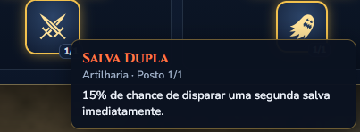
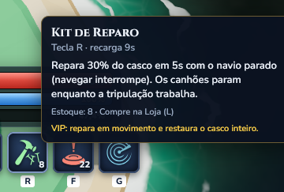
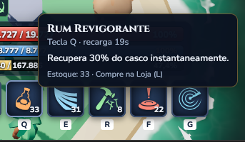
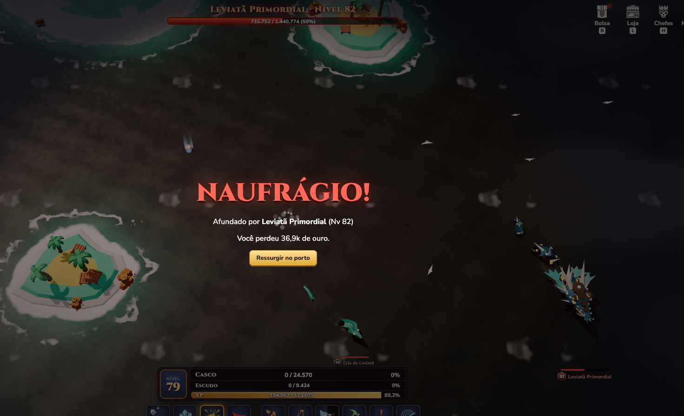

# Observações de balanceamento

Registro de percepções e pontos a medir durante o QA. Usar IDs sequenciais. Uma percepção de desbalanceamento não confirma um bug nas regras ou nos cálculos.

## BAL-001 — EXP de missões repetitivas e ritmo de progressão

**Status:** percepção do teste manual; valores e ritmo ainda não medidos.

**Relato:** missões repetitivas que concedem EXP a cada 16 monstros mortos parecem dar EXP demais e incentivam repetir sempre a mesma atividade. A preocupação é que subir de nível fique rápido demais e pouco variado.

**Evidência:** a captura mostra a missão “Recompensa: Trono”, com objetivo de afundar 16 inimigos no Trono do Leviatã e progresso 6/16. Ela não mostra a quantidade de EXP concedida.

**O que medir:** EXP por abate e por entrega, duração de cada ciclo, EXP por minuto e tempo por nível, considerando bônus de EXP, mapa, nível e build. Comparar a contribuição da missão com outras fontes de progressão e verificar se ela domina as alternativas.

**Direção sugerida:** avaliar recompensa, frequência e variedade dos objetivos para manter um ritmo adequado sem tornar o grind excessivo. A sugestão de desafios a cada 20 níveis está registrada como FEAT-009 em [Sugestões de Features](Sugestões%20de%20Features.md).

## BAL-002 — Densidade de NPCs e dificuldade dos Almirantes

**Status:** ponto de investigação baseado no teste manual; densidade e dificuldade ainda não medidas.

**Relato:** os mapas parecem ter muitos NPCs/monstros próximos. Enfrentar um Almirante fica difícil porque ele já é mais poderoso e outros NPCs se acumulam nos arredores, aumentando a pressão durante o combate.

**Referência do jogador:** a densidade percebida lembra mais Pirate Storm do que Seafight. Pela experiência relatada com mapas novos de Seafight, muitos NPCs atacando por conta própria também podem ser uma escolha de design para exigir builds com mais redução de dano e vida, sacrificando dano por defesa. Essas referências são impressões do jogador, sem comparação quantitativa entre os jogos.

### Objetivo a definir antes de ajustar

Determinar se cada Almirante foi pensado para combate solo, solo com build especializada ou combate em grupo. A dificuldade causada pelos NPCs ao redor pode fazer parte dessa proposta. Reduzir demais a densidade ou a força dos encontros pode tornar os Almirantes fáceis e diminuir o incentivo ao jogo em grupo.

### O que analisar

- Quantidade e distribuição de NPCs por mapa, alcance de agressão, perseguição e ritmo de reaparecimento.
- Quantos NPCs adicionais entram no combate com o Almirante e quanto contribuem para o dano recebido.
- Sobrevivência e tempo para derrotar o Almirante com builds ofensivas, defensivas e equilibradas, em progressão adequada ao mapa.
- Resultado solo e com diferentes tamanhos de grupo, considerando posicionamento e capacidade de evitar ou controlar inimigos adicionais.
- Se investir em vida, defesa ou redução permite uma adaptação útil, com perda de dano aceitável, ou se a pressão continua inviável para o público pretendido.
- Se recompensas e informações sobre a dificuldade deixam claro o incentivo a enfrentar o Almirante em grupo.

### Direção sugerida

Comparar o encontro com e sem NPCs adicionais para separar a força do Almirante da pressão do mapa. Avaliar densidade, agressividade, reaparecimento e opções de build em conjunto, preservando o desafio e a proposta de grupo quando essa for a intenção. Não presumir que facilitar o encontro ou reduzir a quantidade de NPCs seja a solução antes dessa análise.

## BAL-003 — Salva Dupla e impacto da aleatoriedade no combate

**Status:** preocupação de balanceamento; impacto ainda não medido.

**Efeito exibido:** o talento Salva Dupla, da árvore Artilharia, informa **15% de chance de disparar uma segunda salva imediatamente**. A descrição não informa o dano da segunda salva.

**Relato:** a proposta é interessante e parece funcionar contra NPCs, mas uma segunda salva aleatória pode decidir uma batalha entre jogadores, dando peso excessivo à sorte em relação às decisões estratégicas. O relato menciona “PvE”; pelo contexto de confronto entre jogadores, esta preocupação foi interpretada como **PvP**, pendente de confirmação.

### Alternativas sugeridas

- Reduzir o poder do talento ou removê-lo da árvore.
- Transferir a mecânica para um canhão específico, tornando-a uma escolha de equipamento com contrapartidas.
- Fazer a segunda salva causar uma fração do dano da primeira, em vez de assumir dano integral. O percentual deve ser definido após testes; o comportamento atual ainda precisa ser verificado.

### O que validar

Confirmar o dano da segunda salva, sua interação com críticos e efeitos por acerto e se ela pode ativar outra Salva Dupla. Comparar combates com e sem o talento usando várias sementes, medindo dano em janelas curtas, tempo para matar, variação dos resultados e taxa de vitória entre builds comparáveis.

Avaliar separadamente PvE e PvP: um ganho médio aceitável pode esconder picos que encerram um confronto sem oportunidade de reação. A análise deve identificar quando o efeito favorece decisões de build e quando a ativação aleatória pesa demais no resultado.

## BAL-004 — Kit de Reparo: progressão e vantagem do VIP

**Status:** revisão da percepção inicial de nerf; diferenças entre fases e VIP precisam ser medidas.

### Regras exibidas nas capturas

- **Kit de Reparo (R):** recarga de 9 segundos; repara 30% do casco em 5 segundos com o navio parado; navegar interrompe o reparo; os canhões param durante o trabalho.
- **Benefício VIP anunciado:** permite reparar em movimento e restaura o casco inteiro. A descrição não esclarece se o tempo e as demais restrições permanecem iguais; verificar o comportamento.
- **Rum Revigorante (Q):** recarga de 19 segundos; recupera 30% do casco instantaneamente.

As descrições mencionam **casco**, não escudo. Não presumir que o benefício VIP também restaure o escudo.

### Percepção durante os testes

**Early game:** o reparo gradual parece punitivo em combate. O jogador continua recebendo ataques, deixa de atacar e pode receber mais dano do que recupera, morrendo durante a tentativa de cura.

**Late game:** o reparo parece mais útil e mais equilibrado, compensando parte do dano recebido e oferecendo sobrevida, ainda com risco de morrer. Parar de atacar é uma contrapartida relevante: a escolha percebida é reparar e tentar fugir, quando permitido, ou continuar atirando. Permitir atacar durante o reparo poderia tornar o efeito forte demais, segundo o relato.

**Cura instantânea:** o Rum Revigorante mantém uma função distinta e interessante por recuperar uma parcela do casco imediatamente, sem depender de vários ticks de cura.

### Preocupação principal: diferença entre VIP e não VIP

O jogador percebe o benefício VIP como uma vantagem potencialmente pay-to-win: ele altera tanto a mobilidade durante o reparo quanto a quantidade de casco restaurada. Sem VIP, ficar parado e sem atirar enquanto recebe dano pode transformar o uso do item em uma situação fatal; com VIP, reparar enquanto foge muda significativamente as opções de sobrevivência.

Essa é uma preocupação baseada no relato e nas regras anunciadas, ainda sem comparação controlada que quantifique a vantagem. Verificar também a finalidade do reparo comum: recuperação fora de combate ou opção viável durante combate.

### Direção de análise, em vez de nerf geral

Reavaliar a sugestão anterior de nerfar o R. Comparar early e late game, com e sem VIP, usando condições equivalentes de build e dano recebido. Medir cura efetiva, dano recebido durante o reparo, chance de sobrevivência, capacidade de fuga e impacto em PvP e PvE.

Investigar separadamente a cura gradual, a interrupção dos ataques, a imobilidade e a restauração total do VIP. Se houver ajuste, direcioná-lo à diferença problemática sem enfraquecer indiscriminadamente um recurso que já parece punitivo no início e mais equilibrado no fim do jogo. Avaliar reduzir a vantagem de combate do VIP e preservar opções úteis para quem não o possui.

## BAL-005 — Perda de ouro por naufrágio e tempo de recuperação

**Status:** ponto de análise econômica; fórmula e impacto ainda não medidos.

**Relato:** atualmente o naufrágio desconta uma porcentagem do ouro que o jogador possui. Avaliar se a perda é proporcional ao ritmo de obtenção de ouro ou se pode consumir o equivalente a várias horas ou dias de farm, especialmente quando o jogador acumula recursos.

**Evidência:** a captura informa perda de **82,5 mil de ouro** após ser afundado por **Almirante Armada Dourada (nível 81)**. O print não informa o saldo anterior nem o percentual aplicado.

### O que medir

- Confirmar percentual, base de cálculo, arredondamento e existência de limites da penalidade.
- Medir ouro líquido por hora (ganhos menos gastos com munição, consumíveis e outros custos) por faixa de progressão, mapa e build.
- Comparar a perda com esse rendimento: **tempo de recuperação = ouro perdido / ouro líquido por hora**, quando o rendimento for positivo.
- Avaliar saldos baixos e altos, frequência de naufrágios e mortes consecutivas. Separar PvE e PvP caso as regras ou o risco sejam diferentes.
- Verificar se a penalidade desestimula excessivamente guardar ouro, explorar mapas novos ou enfrentar Almirantes em grupo.

### Direção sugerida

Definir uma faixa desejada de esforço para recuperar a perda, mantendo consequência para o naufrágio sem apagar progresso desproporcionalmente. Se o percentual sobre o saldo gerar perdas excessivas, avaliar um teto, faixas ou outra base de cálculo ligada à progressão. Os valores devem partir das medições, sem presumir que a perda de 82,5 mil já represente horas ou dias de farm.

## BAL-006 — Leviatã Primordial: resposta à fase de submersão

**Status:** percepção do teste manual; dano, gatilho e possibilidades de reação ainda não medidos.

**Relato:** o boss é desafiador, mas ao passar de aproximadamente metade da vida submerge e reaparece em cima do jogador. O dano é percebido como praticamente uma morte instantânea, sem uma ação eficaz que o jogador consiga tomar para responder.

**Evidência:** a captura mostra o naufrágio causado pelo Leviatã Primordial (nível 82), com a barra do boss indicando 50% de vida e o jogador no nível 79. A imagem não comprova a sequência do ataque nem o dano de um único golpe.

**O que analisar:** gatilho da fase, sinalização antes de submergir e emergir, tempo para reação, escolha da posição de retorno, área atingida e dano. Testar movimento, builds defensivas e combate em grupo na progressão pretendida, verificando se já existe uma resposta viável e se ela é compreensível para o jogador.

**Direção sugerida:** preservar a dificuldade, mas avaliar uma janela de resposta baseada em decisão e execução: aviso do ataque, possibilidade de esquiva ou defesa temporária. Se a luta for destinada a grupos, verificar também se a mecânica permite resposta coletiva. A sugestão de item de escudo está registrada como FEAT-017; não presumir que um novo consumível seja a única solução ou que reduzir todo o dano do boss seja necessário.

