# Sugestões de features

Ideias levantadas durante o QA para avaliação do desenvolvedor. Não representam bugs confirmados nem funcionalidades cuja ausência já foi verificada. Usar IDs sequenciais para novas sugestões.

## FEAT-001 — NPCs com perfis de atributos diferentes

**Status:** implementada na v1.4.0, conforme atualização informada; reteste pendente.

**Entrega:** Perfis Blindado, Anticrítico e Esquivo, exibidos no quadro do alvo.

Além das habilidades especiais, variar um pouco os atributos de alguns NPCs: mais defesa, redução de dano ou resistência a críticos, por exemplo. Pode ser aplicado a mapas mais altos, novos NPCs e expansões, ou aos conteúdos existentes durante o desenvolvimento.

**Objetivo:** aproveitar a variedade de itens para incentivar builds pensadas para cada situação, com vantagens e contrapartidas, em vez de uma única combinação ser a melhor em todo lugar.

**Exemplos:** builds com mais perfuração contra inimigos cuja defesa seja afetada por esse atributo; builds com foco em crítico onde ele seja eficiente; outras fontes de dano contra inimigos resistentes a críticos.

**Ponto a validar:** perfuração só deve ser apresentada como resposta à redução de dano se as regras do jogo permitirem essa interação. Da mesma forma, mais dano crítico pode compensar anticrítico ou ter pouco valor, dependendo de o anticrítico reduzir a chance, o dano ou impedir críticos. Conferir as fórmulas antes de definir essas especializações.

Evitar apenas aumentar a resistência de todos os inimigos. Os perfis devem criar escolhas perceptíveis, com informações suficientes para o jogador entender e adaptar a build.

## FEAT-002 — Canhões com cadências e danos base distintos

**Status:** implementada na v1.4.0, conforme atualização informada; reteste pendente.

**Entrega:** Canhões rápidos e pesados com diferenças de dano e cadência.

Criar canhões com diferenças de comportamento: um ataca mais rápido, mas causa menos dano por disparo; outro causa mais dano por disparo, mas tem recarga maior.

**Benefício:** ampliar as opções de build e a escolha entre dano contínuo e ataques mais fortes. Avaliar também a interação com críticos, efeitos por acerto e outros bônus, pois cadência maior pode gerar vantagens além do DPS base.

## FEAT-003 — Validar o limite de velocidade de ataque

**Status:** verificação pendente; não confirmado como bug ou recurso ausente.

Verificar se existe um intervalo mínimo entre ataques, equivalente a um limite máximo de velocidade de ataque, mesmo ao combinar itens e buffs de redução de recarga.

**Objetivo:** evitar ataques quase instantâneos e spam de acertos no endgame. Testar combinações extremas no sistema de testes automatizados de balanceamento, incluindo efeitos ativados por acerto. Se o limite já existir, validar se é respeitado; se não existir, avaliar sua necessidade e o valor adequado.

## FEAT-004 — Presets de equipamentos

**Status:** implementada na v1.4.0, conforme atualização informada; reteste pendente.

**Entrega:** Três presets nomeáveis, aplicados com um clique.

Permitir salvar e nomear conjuntos de equipamentos e reaplicá-los sem trocar cada item manualmente, por exemplo: PvE, PvP, defesa e perfuração.

**Benefício:** facilitar o uso de builds específicas por situação. Ao aplicar um preset, informar se algum item não estiver disponível e respeitar as restrições de troca de equipamentos do jogo.

## FEAT-005 — Trancar itens na mochila

**Status:** implementada na v1.4.0, conforme atualização informada; reteste pendente.

**Entrega:** Itens trancados protegidos de venda individual e em lote; proteção contra descarte ainda a retestar.

Adicionar uma opção para trancar e destrancar itens, com indicação visual clara. Itens trancados devem ficar protegidos contra venda individual, venda em lote e descarte até serem destrancados.

**Benefício:** evitar perder equipamentos por engano, especialmente itens guardados para outras builds.

## FEAT-006 — Consumíveis como drops ocasionais de NPCs

**Status:** implementada na v1.4.0, conforme atualização informada; reteste pendente.

**Entrega:** Drops de rum, vento, reparo e Casco Selado.

Permitir que alguns NPCs dropem ocasionalmente consumíveis de regeneração de HP, recuperação de escudo e aumento temporário de velocidade de movimento.

**Benefício:** diversificar recompensas e oferecer recursos úteis durante a exploração. Avaliar frequência, quantidade e efeito na economia para evitar estoque excessivo ou consumo obrigatório em todo combate.

## FEAT-007 — Baús pelo mapa abertos com chaves

**Status:** implementada na v1.4.0, conforme atualização informada; reteste pendente.

**Entrega:** Baús afundados no mapa e minimapa; Chave do Tesouro obtida na Loja ou em drops.

Distribuir baús pelo mapa que possam ser abertos ao ter uma chave no inventário ou comprar uma chave. Definir como as chaves são obtidas e se são consumidas na abertura.

**Benefício:** criar oportunidades de exploração e recompensas além do combate. Mostrar o requisito da chave e confirmar seu uso antes de consumi-la.

## FEAT-008 — Proteção da zona segura condicionada ao fim do combate

**Status:** implementada na v1.4.0, conforme atualização informada; reteste pendente.

**Entrega:** Proteção após 5 segundos sem combate.

Entrar na zona segura perto do porto enquanto estiver em combate deve manter o jogador em combate, sem conceder proteção automaticamente. A proteção da zona só deve ser ativada quando o jogador estiver dentro dela e fora de combate há **X segundos**, com o tempo ainda a definir.

**Objetivo:** impedir que correr para o porto durante uma luta conceda segurança imediata e permita escapar usando a borda da zona.

**Pontos a definir:** quais eventos iniciam e renovam o estado de combate (incluindo dano contínuo e projéteis em trânsito), quando começa a contagem de X segundos e como ações ofensivas afetam a proteção. A regra deve impedir atacar a partir da zona mantendo proteção indevida.

**Indicação na interface:** distinguir estar dentro da zona de estar efetivamente protegido e mostrar quando o combate ou a espera impedem a proteção.

**Cenários para validar:** entrar durante uma luta; entrar já fora de combate há X segundos; encerrar o combate dentro da zona e aguardar o prazo; receber novo dano durante a espera; atravessar repetidamente a borda da zona. Confirmar que a proteção só é concedida quando as condições forem atendidas.

## FEAT-009 — Desafios de progressão a cada 20 níveis

**Status:** implementada na v1.4.0, conforme atualização informada; reteste pendente.

**Entrega:** Desafios a cada 20 níveis com recompensas; detalhes do trecho truncado a conferir.

Introduzir um teste ou desafio a cada 20 níveis para variar a progressão: derrotar determinados NPCs em um mapa, vencer o boss da região ou combinar objetivos diferentes.

**Objetivo:** dar marcos à evolução e reduzir a sequência repetitiva de matar monstros e subir de nível. Definir se o desafio desbloqueia a próxima faixa de níveis ou oferece uma recompensa opcional. Se for obrigatório, garantir acesso ao objetivo e dificuldade adequada para evitar bloquear a progressão injustamente.

Relacionado ao relato sobre EXP de missões repetitivas, registrado como BAL-001 em [Observações de Balanceamento](Observações%20de%20Balanceamento.md).

## FEAT-010 — Item para trocar um atributo do equipamento

**Status:** implementada na v1.4.0, conforme atualização informada; reteste pendente.

**Entrega:** Pedras de Reforja para trocar atributo extra; versão comum aleatória. Detalhes da versão especial e restrição de duplicidade a confirmar.

Permitir escolher um atributo específico do equipamento para substituir, preservando os demais. Poderia haver versões do consumível: uma sorteia o novo atributo; outra, mais especial, permite escolher entre atributos elegíveis.

**Regra sugerida para a versão selecionável:** impedir escolher um atributo que já esteja presente em outro slot de atributo do mesmo equipamento. Confirmar o alcance dessa restrição antes de implementar.

**Benefício:** permitir ajustar itens para builds específicas. Definir atributos elegíveis, faixas de valores, custo e consumo do item; apresentar claramente o resultado ou as possibilidades antes de confirmar a troca.

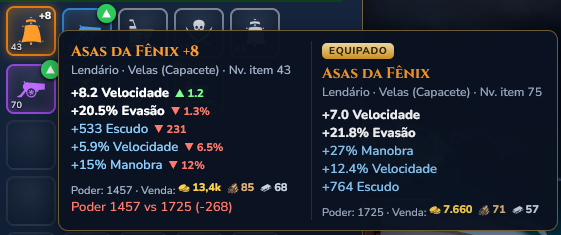

## FEAT-011 — Aba de mascotes em Bolsa & Navio

**Status:** implementada na v1.4.0, conforme atualização informada; reteste pendente.

**Entrega:** Mascotes em uma aba da Bolsa; tecla N mantida.

Mover o gerenciamento dos mascotes para uma aba de **Bolsa & Navio**, assim como já ocorreu com as skins, reduzindo a quantidade de menus no topo. Manter disponíveis as informações e ações atuais de seleção do mascote.

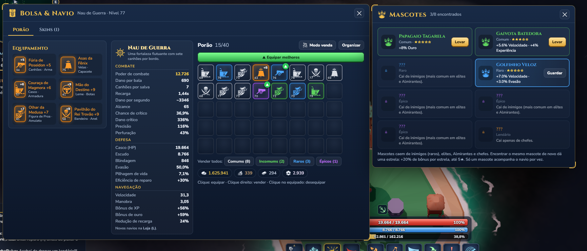

## FEAT-012 — Cards de skins consistentes com os mascotes

**Status:** pendente de confirmação — trecho da atualização sobre skins/loja truncado.

Exibir skins em cards menores, lado a lado, seguindo o padrão visual dos mascotes. Preservar a identificação da skin em uso, a prévia, a descrição e a ação de selecionar, adaptando a quantidade de colunas ao espaço disponível.

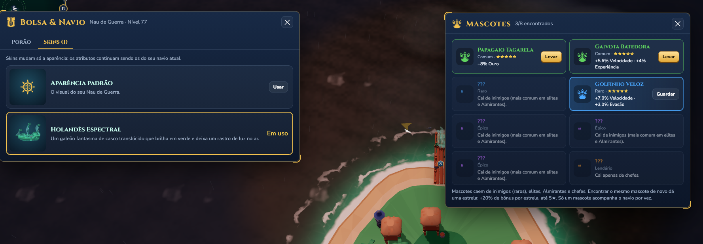

## FEAT-013 — Pequenos bônus de atributos em skins

**Status:** implementada na v1.4.0, conforme atualização informada; reteste pendente.

**Entrega:** Holandês Espectral com +4% de dano e +3% de redução de dano.

Avaliar skins com bônus de atributos, de forma semelhante aos mascotes. Exemplos propostos: +5% de dano, +5% de redução de dano ou outros efeitos distintos. Esses valores são sugestões, não números aprovados.

**Ponto a avaliar:** a interface atual informa que skins mudam somente a aparência. Adicionar bônus altera esse contrato e exige atualizar a comunicação. Medir o impacto combinado com equipamentos, mascotes e buffs, pois 5% pode ter efeito relevante no endgame. Definir também se apenas a skin equipada concede o bônus e como cada opção é obtida.

## FEAT-014 — Campo de busca na loja

**Status:** pendente de confirmação — trecho da atualização sobre skins/loja truncado.

Adicionar um campo de busca por nome para encontrar itens na loja sem percorrer toda a lista. Permitir limpar a busca e indicar quando nenhum resultado for encontrado. Deixar claro se a busca filtra a aba atual ou toda a loja.

**Benefício:** agilizar a compra, principalmente conforme o catálogo crescer.

## FEAT-015 — Quantidade e preço claros nos botões de compra

**Status:** implementada na v1.4.0, conforme atualização informada; reteste pendente.

**Entrega:** Botões identificam quantidade e preço, como Comprar 50 · 🪙250.

Atualmente os botões mostram pares como **50 · 50** e **250 · 250**, sem rótulos que distingam a quantidade recebida do valor pago. A captura também mostra pares com valores diferentes, como **50 · 250**, mantendo a mesma ambiguidade.

Apresentar explicitamente a quantidade e o preço total do pacote, identificando a moeda por ícone ou nome. Exemplo de formato: **Comprar 50 un. — 250 [moeda]**. Se necessário, usar duas linhas: **Quantidade: 50** e **Preço: 250 [moeda]**.

**Benefício:** permitir entender o que será recebido e quanto será gasto antes da compra. Confirmar a ordem dos valores atuais e a moeda utilizada antes de aplicar os rótulos.

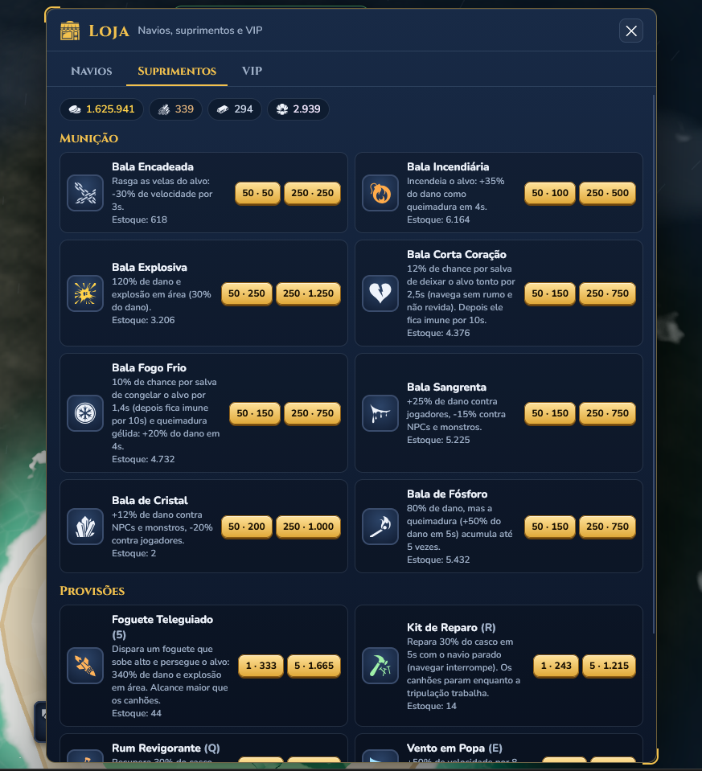

## FEAT-016 — Talento de magnetismo para coleta de baús

**Status:** implementada na v1.4.0, conforme atualização informada; reteste pendente.

**Entrega:** Talento Magnetismo aumenta o alcance de atração dos baús.

Adicionar um talento de magnetismo que aumente a distância a partir da qual os baús dropados começam a ser atraídos até o jogador. O alcance cresce conforme a quantidade de pontos investidos.

**Benefício:** oferecer uma opção de conveniência na árvore de talentos, facilitando a coleta durante a navegação.

**Pontos a definir:** alcance base, aumento por ponto, quantidade máxima de pontos e posição na árvore. Mostrar o alcance atual e o ganho do próximo ponto na descrição do talento.

O talento aumenta o alcance de atração. A falha em que o baú não consegue alcançar um navio em movimento continua registrada como **BUG-002** em [Bugs Encontrados](Bugs%20Encontrados.md) e precisa ser corrigida independentemente do investimento nesse talento.

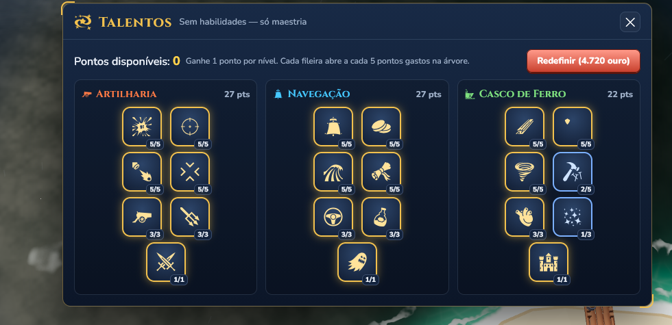

## FEAT-017 — Item de escudo para uso estratégico

**Status:** implementada na v1.4.0, conforme atualização informada; reteste pendente.

**Entrega:** Casco Selado (V), com redução de 70% de dano; duração e recarga a conferir.

Adicionar um item que conceda proteção temporária e possa ser ativado em um momento específico para responder a ataques fortes anunciados, como a emergência do boss após submergir.

**Objetivo:** oferecer uma decisão de timing e uma chance de sobrevivência, mantendo o desafio do encontro.

**Pontos a definir:** duração, quantidade de dano absorvida ou reduzida, recarga, custo e interação com outras defesas. Garantir sinalização e tempo suficiente para uso. Avaliar o impacto em PvE e PvP e evitar que a sobrevivência dependa exclusivamente de um item pago ou de difícil acesso.

## FEAT-018 — Respawn em local aleatório do mapa

**Status:** implementada na v1.4.0, conforme atualização informada; reteste pendente.

**Entrega:** Escolha entre porto e ponto tranquilo do mapa.

Após o naufrágio, permitir que o jogador reapareça em um local aleatório do mesmo mapa, como alternativa ao retorno fixo ao porto.

**Pontos a avaliar:** selecionar posições válidas e seguras, evitando obstáculos, bosses e inimigos próximos que provoquem uma nova morte imediata. Definir se substitui o respawn no porto ou se o jogador pode escolher entre as duas opções.

Avaliar o impacto no deslocamento, nas lutas em grupo e no PvP, para que morrer não se torne um atalho vantajoso nem permita retornar imediatamente à luta sem consequência.

## FEAT-019 — Medalhas e progressão PvP

**Status:** sugestão.

Implementar medalhas PvP associadas a uma progressão por pontos de batalha, usando como referência conceitual o sistema de Seafight citado pelo jogador.

**Objetivo:** reconhecer a participação e os resultados em combates entre jogadores, oferecendo metas e conquistas específicas para PvP.

**Pontos a definir:** ações que concedem pontos, critérios para desbloquear medalhas, faixas de progressão e eventuais recompensas. Avaliar participação e diferença de força entre os envolvidos, além de regras contra farm combinado e derrotas repetidas do mesmo jogador.

Evitar que recompensas de poder ampliem excessivamente a vantagem de quem já domina o PvP; avaliar reconhecimento visual e recompensas que preservem a competitividade.

## Acompanhamento da v1.4.0

Status atualizados a partir das notas enviadas pelo jogador em 29/09/2026, sem reteste ou inspeção do código do jogo. Descrições e imagens anteriores foram preservadas como histórico. FEAT-003 (limite de velocidade de ataque) e FEAT-019 (medalhas PvP) seguem pendentes.

## FEAT-020 — Visibilidade por alcance e surgimento aleatório de baús

**Status:** sugestão de refinamento dos baús implementados na FEAT-007.

Exibir os marcadores dos baús na carta náutica e no minimapa apenas quando estiverem dentro do alcance de coleta do jogador. Fora desse alcance, ocultar o marcador. A regra trata da exibição: não implica remover o baú do mundo.

Permitir que os baús surjam em locais aleatórios válidos do mapa, evitando posições inacessíveis ou dentro de obstáculos.

**Objetivo:** incentivar exploração e descoberta por proximidade, em vez de revelar a localização de todos os tesouros à distância.

**Pontos a definir e validar:** qual alcance rege a exibição e se o talento Magnetismo o modifica; frequência de surgimento e quantidade de baús ativos. Confirmar que os marcadores aparecem e desaparecem corretamente ao entrar e sair do alcance e que todos os pontos de surgimento permitem acesso ao baú.

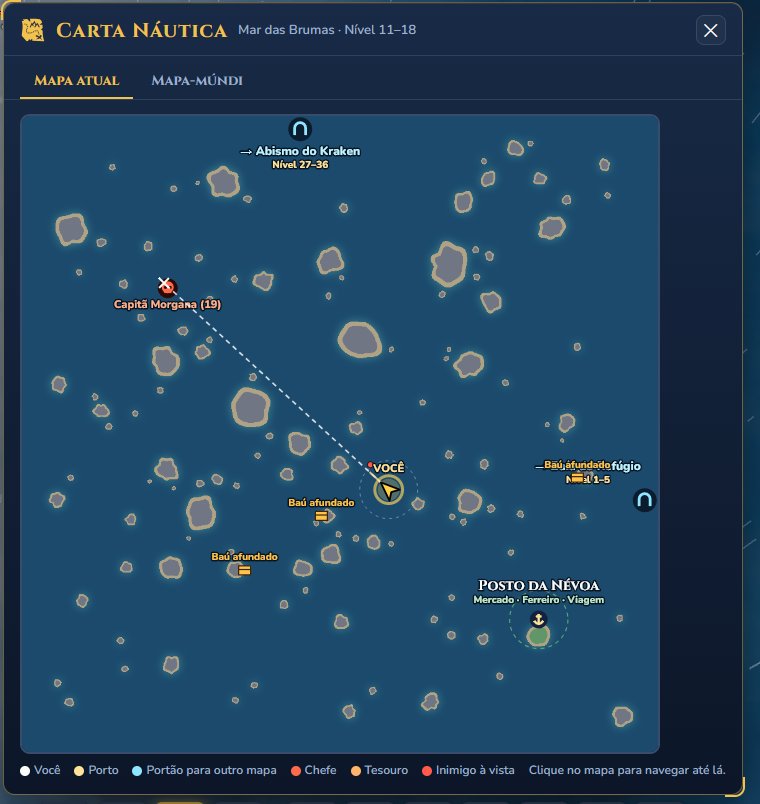

## FEAT-021 — Seta indicativa para missão rastreada

**Status:** sugestão.

Permitir marcar uma missão como **Rastrear** e usar a seta indicativa para apontar em direção ao objetivo atual dessa missão.

**Benefício:** facilitar a orientação durante a navegação e a identificação de qual objetivo o jogador está seguindo.

**Pontos a definir:** selecionar uma missão rastreada por vez; atualizar ou ocultar a seta ao concluir ou parar de rastrear; em missões com várias etapas, indicar a etapa ativa. Se o objetivo estiver em outro mapa, apontar para o portal adequado. Para objetivos distribuídos, como derrotar vários inimigos, definir se aponta para a região ou para um alvo elegível.

Identificar a missão associada à seta e definir a prioridade em relação a outros destinos de navegação, evitando indicações conflitantes. Respeitar regras de descoberta de objetivos ocultos, como tesouros, caso existam.

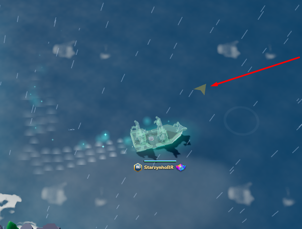

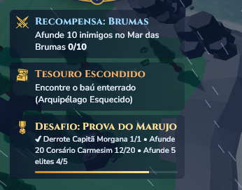

## FEAT-022 — Presets de talentos

**Status:** sugestão.

Permitir salvar e nomear distribuições de pontos de talentos, como PvE, PvP, Defesa e Farm, e reaplicá-las sem redistribuir cada ponto manualmente.

**Benefício:** facilitar a troca entre builds para diferentes situações, complementando os presets de equipamentos da FEAT-004.

**Pontos a definir:** quantidade de presets, custo de troca e condições em que podem ser aplicados. Se houver custo de redefinição, exibir o valor antes de confirmar. Validar pontos disponíveis, requisitos das fileiras e exclusividade dos talentos conforme as regras atuais; impedir trocas durante combate se isso permitir vantagens indevidas.

Presets devem guardar a configuração sem conceder pontos extras. Após alterações na árvore, informar configurações incompatíveis e permitir revisá-las.

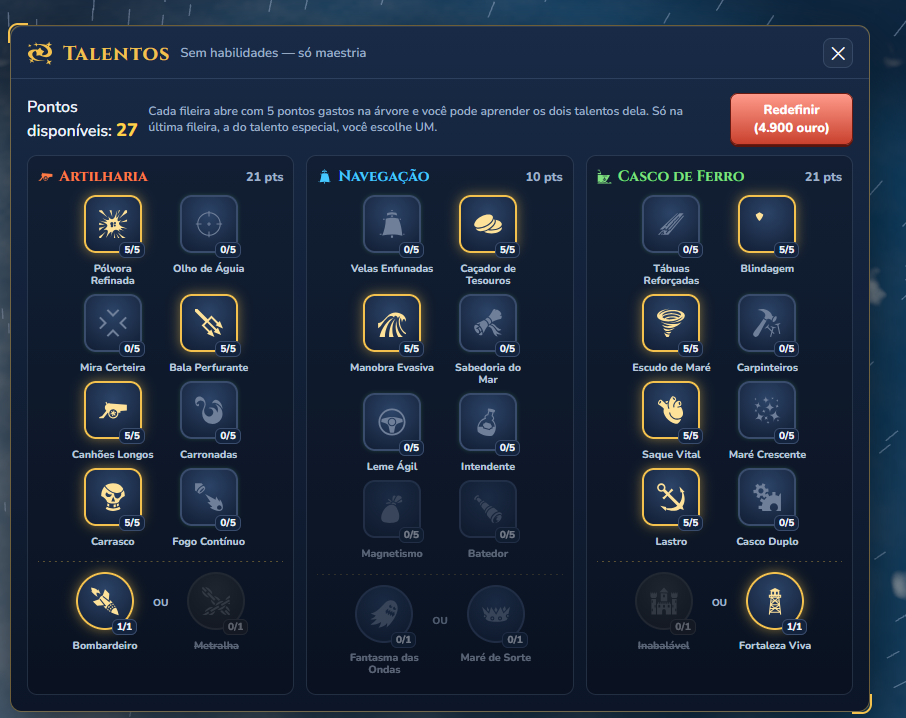

## FEAT-023 — Redefinir um talento individualmente

**Status:** sugestão.

Permitir redefinir apenas um talento e recuperar os pontos investidos nele, mantendo a distribuição dos demais talentos.

**Benefício:** facilitar pequenos ajustes na build sem precisar redefinir a árvore inteira.

**Pontos a definir:** custo da redefinição individual e restrições durante combate. Validar os requisitos das fileiras seguintes: se a retirada dos pontos invalidar outro talento, explicar a dependência e bloquear a operação ou apresentar os talentos adicionais afetados antes de confirmar, sem redefini-los silenciosamente.

## FEAT-024 — Aviso de mochila cheia e coleta impedida

**Status:** sugestão de clareza da interface, registrada em 30/09/2026.

Exibir um indicativo perceptível quando a mochila atingir sua capacidade, inclusive durante a navegação sem a janela Bolsa & Navio aberta. Quando um baú do mapa não puder ser coletado por falta de espaço, informar claramente o motivo, por exemplo: **Mochila cheia — libere espaço para coletar o baú**.

**Benefício:** evitar que o jogador continue tentando coletar sem entender por que o baú permanece no mapa.

**Pontos a validar:** confirmar em quais recompensas a capacidade impede a coleta; não atribuir toda falha de coleta à mochila cheia. Evitar mensagens repetidas continuamente e atualizar o aviso ao liberar espaço. Se a coleta for bloqueada, preservar o baú e não consumir a chave sem entregar a recompensa.

**Referência visual:** a captura mostra 7/40 slots ocupados, após venda de itens; documenta a interface, não uma mochila cheia nem a causa de uma falha de coleta.

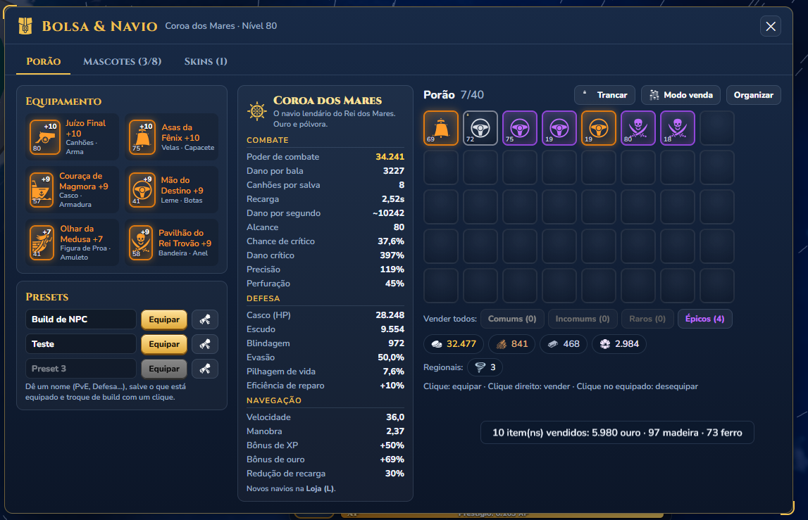

## FEAT-025 — Custo e estoque claros ao alimentar mascotes

**Status:** sugestão de clareza da interface, registrada em 30/09/2026.

Mostrar junto da ação **Alimentar** qual recurso será usado, quanto será consumido por alimentação e quantas unidades o jogador possui. Exibir também o saldo restante previsto, por exemplo: **Consumir 3 [material] · Disponível: 12 · Restam: 9**.

**Contexto:** a tela informa no texto geral que a alimentação usa Petiscos ou 3 unidades de material regional, mas os botões não identificam o recurso e o custo da ação específica.

**Pontos a definir:** permitir escolher o recurso ou deixar explícita a prioridade automática de consumo. Identificar materiais por nome e ícone; atualizar o estoque após alimentar e explicar a falta de recursos quando o botão estiver desabilitado. Não consumir um material alternativo sem tornar essa escolha clara ao jogador.

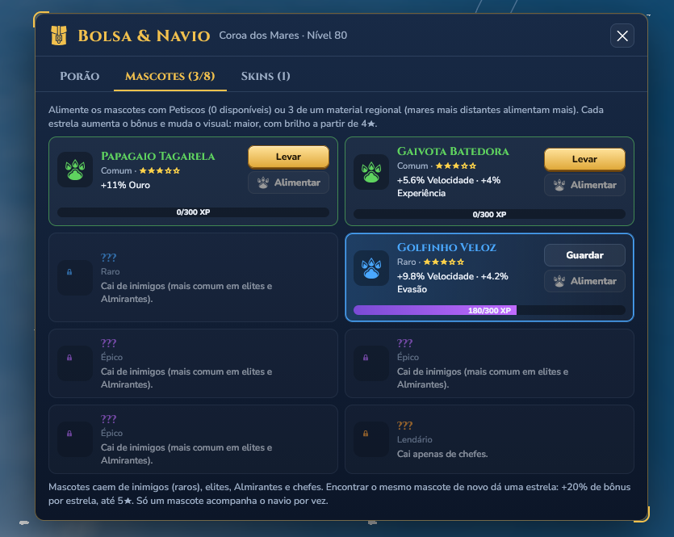

## Referências visuais

Capturas da interface de equipamentos, inventário e atributos usadas como contexto para as sugestões. Elas não comprovam a ausência dos recursos propostos.

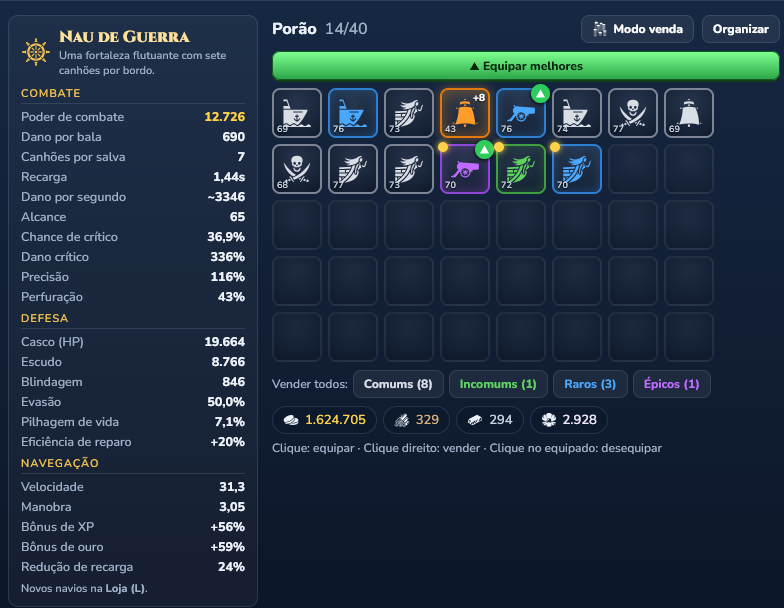

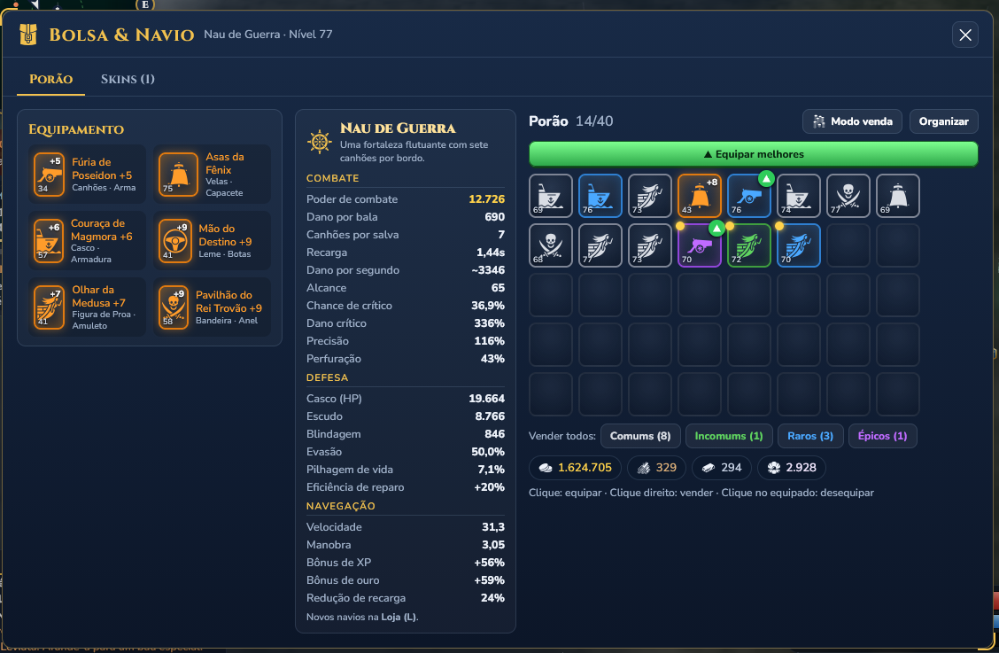
